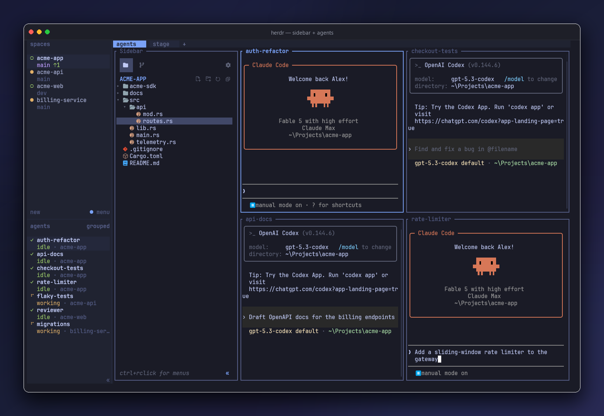
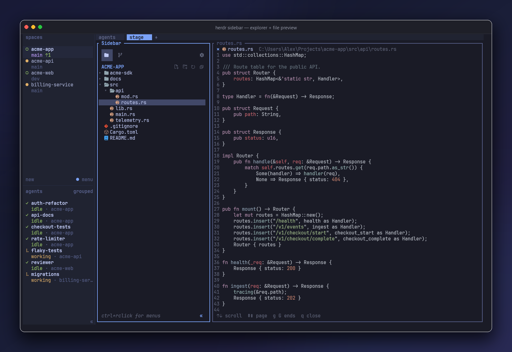
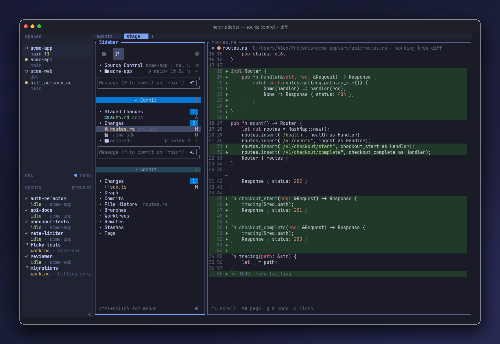
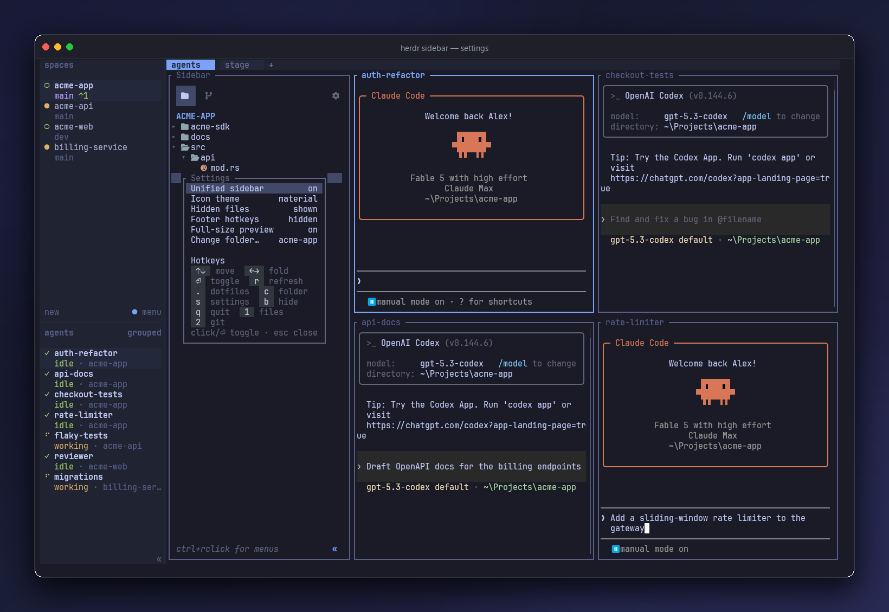
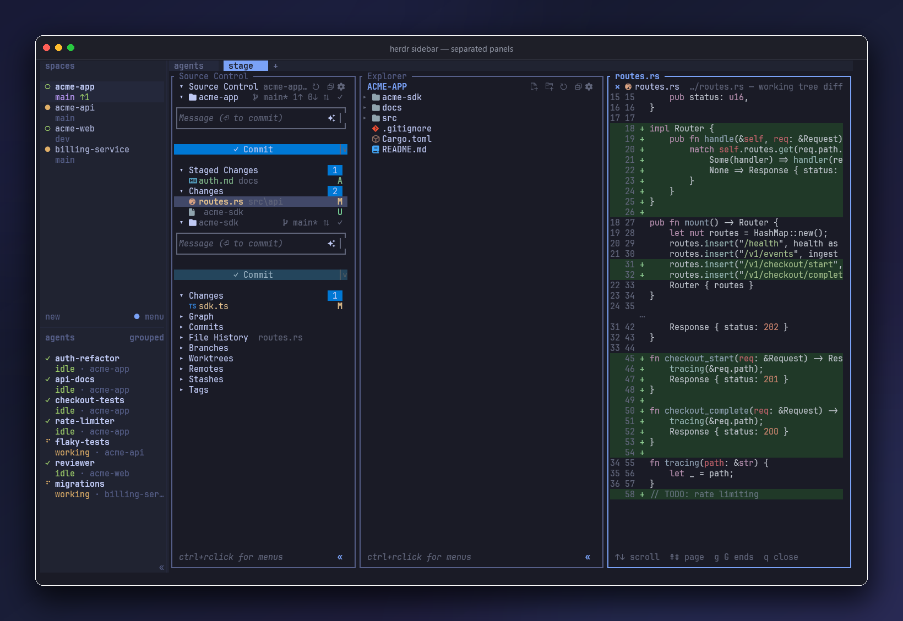

<div align="center">
  

  <h1 style="border-bottom: none; margin-bottom: 0;">herdr-plugins</h1>
  <h3 style="margin-top: 0; font-weight: normal;">
    a vs code-style sidebar, live preview, and git for <a href="https://herdr.dev">herdr</a>
  </h3>

  <p>
    <a href="https://herdr.dev"><strong>herdr</strong></a>
    ·
    <a href="https://github.com/stevederico/herdr-plugins"><strong>GitHub</strong></a>
  </p>
</div>

<br />

## 🚀 Quick Start

```bash
git clone https://github.com/stevederico/herdr-plugins.git
cd herdr-plugins
(cd sidebar && cargo build --release)
herdr plugin link ./sidebar
herdr plugin link ./git-badge
herdr plugin link ./space-title
herdr plugin link ./space-status
```

Focus a tab. The sidebar docks on the left. Click a file: the preview opens on the far right.

Rebuild later:

```bash
(cd sidebar && cargo build --release)
herdr plugin action invoke herdr-sidebar.redeploy
```

Then click the file again so the preview process picks up the new binary.

<br />

## ✨ What's Included

Steve's local [herdr](https://herdr.dev) plugins in one repo. `herdr-sidebar` is the product. The others are small workspace helpers.

### 📁 **Explorer**
- **VS Code-style tree** in one dockable pane: single-click folders, Material or emoji icons
- **Follows the agent cwd** so the tree tracks the Grok pane you are in
- **Re-root** on double-click; parent up-arrow when macOS hides the listing
- **Context menus** (ctrl/right-click): new file, new folder, rename, delete, copy path
- **Activity bar** switches Files (`1`) and Git (`2`) in process: no pane flash

### 👁️ **File Preview**
- **Opens on the far right** (explorer | agent | preview). One viewer per tab; clicks reuse it
- **Live-reloads from disk** when an agent (or anything else) writes the open file. Markdown included. ~80ms
- **Markdown** opens Rendered. Lines wrap to the pane. Click the chip for Raw. Type in Rendered to drop back into Raw. Click a box to toggle tasks
- **Edit**: type, Ctrl+S to save, Ctrl+A / Ctrl+C to copy
- **Images and video** rasterize in the pane. `o` opens the real file at full resolution
- **Full-size preview** (default on): other panes park while you read; Esc restores them

### 🔀 **Source Control**
- **Stage, unstage, commit, sync** with a VS Code-shaped diff (dual gutters, tinted rows)
- **✧ suggest** writes a commit subject from the pending diff (`claude` CLI, filename fallback)
- **Graph, commits, file history, branches, worktrees, remotes, stashes, tags**
- **Live diffs** in [hunk](https://hunk.dev) when it is installed (`hunk diff --watch`). Git view fills an empty preview. prefix+d opens hunk from any pane. Falls back to the built-in renderer without hunk

### 🧩 **Workspace helpers**
- **git-badge** puts `*` next to the folder name when the worktree is dirty or unpushed
- **space-status** puts 🔨 / ✅ / ⚠️ / ⚪ on spaces (working, done, blocked, idle)
- **space-title** renames spaces from the Grok/agent session title
- **explorer** is a thin leftover file tree. Keep it disabled if you run the sidebar

<br />

## 🔌 Plugins

| Dir | Plugin id | What |
|-----|-----------|------|
| `sidebar/` | `herdr-sidebar` | Explorer + SCM + preview (0.32.0) |
| `git-badge/` | `herdr-git-badge` | Folder `*` when dirty or unpushed |
| `space-status/` | `herdr-space-status` | 🔨 working, ✅ done, ⚠️ blocked, ⚪ idle |
| `space-title/` | `herdr-space-title` | Rename spaces from session titles |
| `explorer/` | `herdr-explorer` | Thin file tree (optional) |

`herdr-sidebar` needs herdr **0.7.0+**. Linux, macOS, Windows.

<br />

## 🖼️ Preview and Git

<p align="center">
  
</p>

<p align="center">
  
</p>

<p align="center">
  
</p>

<p align="center">
  
</p>

<br />

## ⌨️ Keys

Hotkey chips live in **Settings**. Footer chips are off by default.

### Explorer

| Key | Action |
|-----|--------|
| `↑` `↓` / `j` `k` | move |
| `←` `→` / `h` `l` | fold / expand |
| `Enter` / click | toggle folder or open preview |
| `r` | refresh |
| `.` | hidden files |
| `c` | change folder |
| `u` / Backspace | parent |
| `s` | settings |
| `b` | hide sidebar |
| `Esc` | close preview |
| `1` / `2` | files / git (unified mode) |
| `q` | quit pane |

### Preview

| Key | Action |
|-----|--------|
| type | edit (Rendered: first key drops into Raw) |
| click chip | markdown Raw / Rendered |
| click box | toggle `- [ ]` / `- [x]` |
| Ctrl+S | save |
| Ctrl+A / Ctrl+C | select all / copy |
| `o` | open image or video at full resolution |
| `Esc` / `q` | close |

Disk wins: if the file changes on disk, the pane reloads even while you watch an agent write it.

### Source Control

| Key | Action |
|-----|--------|
| `Enter` | stage / unstage |
| `a` / `u` | stage all / none |
| `c` | commit message |
| `A` | ✧ suggest message |
| `j` `k` | move (sidebar focused, no prefix) |
| click / `o` | open hunk (or built-in diff) |
| prefix+d | open hunk in this tab |
| `S` | sync |
| `r` | refresh |

<br />

## ⚙️ Settings

Gear in the sidebar header, or `s`.

| Setting | Default | What |
|---------|---------|------|
| Unified sidebar | on | one pane, `1`/`2` switch views. Off: separate Explorer + Source Control |
| Icon theme | material (auto) | Material Nerd Font or emoji |
| Hidden files | hidden | dotfiles in the tree |
| Footer hotkeys | hidden | chips under the tree |
| Full-size preview | on | park other panes while previewing |
| Change folder | cwd | re-root the tree |

<br />

## 🛠️ Link (dev)

This repo lives at `~/Projects/herdr-plugins` on the author machine. Plugin links store **absolute paths**. Move the repo, then unlink and relink or every plugin shows `manifest unavailable`.

```bash
herdr plugin uninstall herdr-sidebar   # if still GitHub-managed
herdr plugin link ~/Projects/herdr-plugins/sidebar
herdr plugin link ~/Projects/herdr-plugins/git-badge
herdr plugin link ~/Projects/herdr-plugins/space-title
herdr plugin link ~/Projects/herdr-plugins/space-status
herdr plugin link ~/Projects/herdr-plugins/explorer   # optional
herdr plugin disable herdr-explorer                   # if you only want sidebar
```

Verify: `herdr plugin list` with no `warning:` lines.

Actions worth knowing:

```bash
herdr plugin action invoke herdr-sidebar.open-sidebar    # linux / macos toggle
herdr plugin action invoke herdr-sidebar.open-git        # separate SCM pane
herdr plugin action invoke herdr-sidebar.new-agent       # new workspace + Grok
herdr plugin action invoke herdr-sidebar.redeploy        # respawn every sidebar pane
sidebar/target/release/herdr-sidebar --open-file todos.md  # agent: this tab's preview
herdr plugin action invoke herdr-sidebar.open-hunk         # prefix+d: hunk in this tab
```

Windows uses the `-windows` action ids (`open-sidebar-windows`, and so on).

<br />

## 🧰 Tech Stack

| Technology | Version | Purpose |
|------------|---------|---------|
| **Rust** | edition 2024 | sidebar + explorer |
| **ratatui** | 0.30 | TUI |
| **crossterm** | 0.29 | keys, mouse, PTY |
| **syntect** + **two-face** | 5 / 0.4 | diff syntax (bat grammars) |
| **herdr plugin API** | 0.7.0+ | panes, actions, events, socket IPC |
| **bash** + **python3** | system | git-badge, space-title, launchers |

Markdown preview is hand-rolled (`sidebar/src/md.rs`): no markdown crate. File follow hashes bytes on a short tick; it does not wait on `event::poll` timeouts.

<br />

## 📚 Architecture

One `herdr-sidebar` binary, three roles:

1. **Explorer / SCM TUI** in the left pane (unified, or `--view explorer|git`)
2. **`--preview <ctl>`** in the right pane: file contents, markdown, media, git diffs
3. **`herdr-sidebar-ensure`** windowless sidecar for Windows hooks (no console flash)

The sidebar writes a **control file** per tab (`herdr-sidebar-preview-<pane>.ctl`). The viewer polls it and reloads in place, so clicks never churn panes. For an open file it also re-reads the path when the bytes change, so an agent write shows up without another click.

Pane identity is a heartbeat token on `pane.report_metadata`. Launchers treat a stale stamp as a dead pane and replace it. Focus/create hooks dock a left sidebar per tab and heal corpses after a herdr restart.

<br />

## 🤝 Contributing

```bash
git clone https://github.com/stevederico/herdr-plugins.git
cd herdr-plugins/sidebar
cargo test --offline
cargo build --release
```

`git-badge` and `space-title` are scripts. No extra toolchain.

<br />

## 📬 Community & Support

- **X**: [@stevederico](https://x.com/stevederico)
- **Issues**: [GitHub Issues](https://github.com/stevederico/herdr-plugins/issues)

<br />

## 🙏 Acknowledgements

- [herdr](https://herdr.dev) - terminal workspace this docks into
- [ratatui](https://ratatui.rs) - TUI toolkit
- [syntect](https://github.com/trishume/syntect) / [two-face](https://github.com/CosmicHorrorDev/two-face) - syntax dumps
- [VS Code](https://code.visualstudio.com) - explorer + SCM shape

<br />

## 🎪 Related Projects

- [herdr](https://herdr.dev) - terminal multiplexer these plugins run in

<br />

## 🚀 Ready?

```bash
(cd sidebar && cargo build --release)
herdr plugin link ./sidebar
```

<br />

## 📄 License

[MIT License](LICENSE).

<br />

<div align="center">
  <sub>Built for <a href="https://herdr.dev">herdr</a></sub>
  <br />
  <sub>If this saves you a round trip to VS Code, <a href="https://github.com/stevederico/herdr-plugins">star the repo</a>.</sub>
</div>
